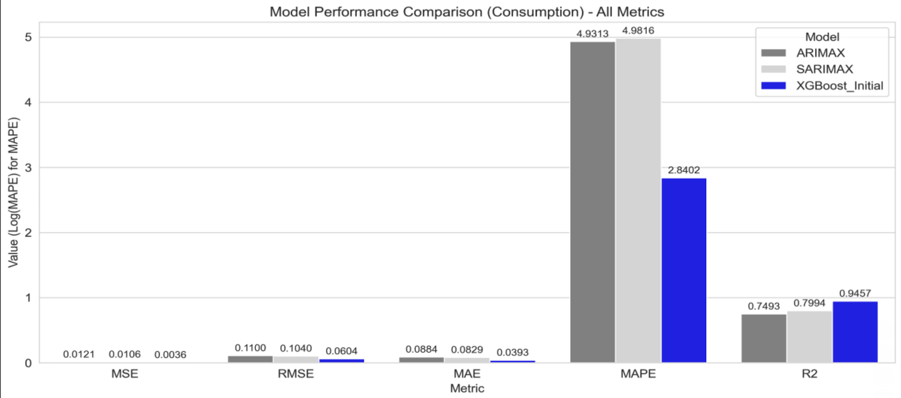
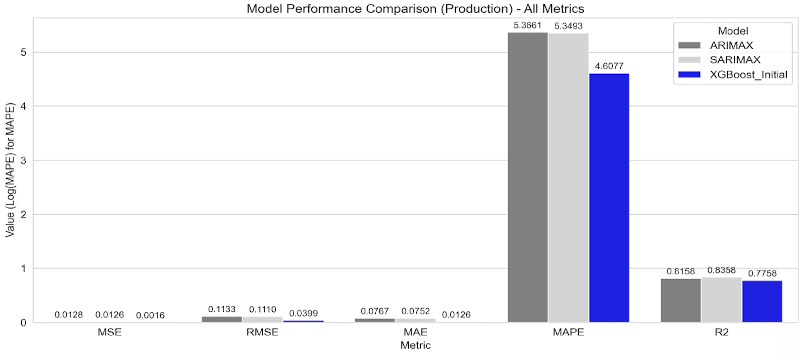

# Solar Prosumer Energy Forecasting


> **A machine learning pipeline utilizing LSTM and XGBoost to predict electricity consumption and production behaviors of solar panel prosumers.**

## 📖 Overview

**Solar Prosumer Energy Forecasting** is a predictive analytics project designed to address the energy imbalance issues inherent in modern smart grids. Leveraging the **Enefit** dataset, this project aims to minimize the "energy imbalance cost" by accurately forecasting how prosumers (consumers who also produce energy) behave.

The solution moves beyond traditional statistical baselines (ARIMA/SARIMA), implementing advanced Deep Learning (**LSTM**) and Gradient Boosting (**XGBoost**) techniques. Following the **CRISP-DM** methodology, the project covers the full data science lifecycle—from rigorous feature engineering and scaling to hyperparameter optimization via Optuna.

---

## ✨ Key Features

### 🧠 Advanced Modeling Architectures
* **eXtreme Gradient Boosting (XGBoost):**
    * High-performance ensemble models optimized for tabular time-series data.
    * Achieved superior performance through automated hyperparameter tuning (Grid Search & Random Search).
* **Long Short-Term Memory (LSTM):**
    * Custom-built Recurrent Neural Networks (RNN) designed to capture temporal dependencies.
    * Implemented with callbacks for Early Stopping and Learning Rate Reduction.

### 🛠 Data Engineering Pipeline
* **Robust Preprocessing:** Linear interpolation for core variables and median imputation for auxiliary features to handle missing data.
* **Noise Reduction:** Applied "Time-windowed mean smoothing" to meteorological data to reduce short-term volatility.
* **Feature Construction:**
    * **Lag Features:** `lag_prod_1h` / `lag_cons_1h` to capture historical effects.
    * **Cyclical Encoding:** `sin_hour`, `cos_doy` to preserve daily and seasonal periodicities.

### 📊 Model Optimization
* **Hyperparameter Tuning:** Integration with **Optuna** for Bayesian optimization of model parameters (e.g., learning rates, tree depth, dropout rates).
* **Comprehensive Metrics:** Evaluation based on **RMSE**, **MAE**, **$R^2$**, and **MAPE**.

---

## 📈 Performance

Based on the empirical analysis of the **Enefit** dataset, the tuned XGBoost model demonstrated superior predictive capabilities. As shown below, the Machine Learning approach (XGBoost) significantly reduced error rates compared to traditional statistical baselines (ARIMA/SARIMA).

### Model Comparison (Baseline vs. XGBoost)

<p float="left">
  
  
</p>

> **Figure 1:** Comparison of XGBoost against ARIMAX and SARIMAX baselines. Note the drastic reduction in MAPE (Mean Absolute Percentage Error) for the XGBoost model (Blue bar).

### Evaluation Results (Test Set)

| Model Category | Task | $R^2$ Score | RMSE | MAE |
| :--- | :--- | :--- | :--- | :--- |
| **SARIMAX (Baseline)** | Consumption | 0.7994 | 0.5302 | 0.4846 |
| | Production | 0.8358 | 0.2815 | 0.1541 |
| **LSTM (Tuned)** | Consumption | 0.8938 | 0.0654 | 0.0437 |
| | Production | 0.9552 | 0.0559 | 0.0276 |
| **XGBoost (Tuned)** | **Consumption** | **0.9567** | **0.0534** | **0.0346** |
| | **Production** | **0.9686** | **0.0422** | **0.0137** |

### Key Insights
* **Production Drivers:** Highly sensitive to **surface solar radiation** and **direct solar radiation**.
* **Consumption Drivers:** Heavily influenced by **historical lag features** (1-hour prior usage), reflecting strong behavioral inertia.
* **Model Fusion Findings:** Initial experiments with model fusion (Weighted Average, Deep Learning Stacking) were conducted. However, the standalone **XGBoost** model proved more robust and computationally efficient for this specific tabular dataset.

---

## 📂 Project Structure

```text
Time_Series_Forecasting/
├── Data/
│   ├── final_data_for_consumption_scaled.csv    # Pre-processed/Scaled consumption data
│   └── final_data_for_production_scaled.csv     # Pre-processed/Scaled production data
├── Models/
│   ├── LSTM_consumption_model.py                # Deep Learning training script (Consumption)
│   ├── LSTM_production_model.py                 # Deep Learning training script (Production)
│   ├── xgboost_consumption_model.py             # Gradient Boosting script (Consumption)
│   └── xgboost_production_model.py              # Gradient Boosting script (Production)
├── Time Series Forecasting of Energy Behavior.pdf # Full Project Report
└── README.md                                    # Project Documentation

```

---

## 🚀 Getting Started

### Prerequisites

* Python 3.8+
* TensorFlow (2.x)
* XGBoost
* Optuna

### Installation

1. **Clone the repository:**
```bash
git clone [https://github.com/your-username/Solar-Prosumer-Forecasting.git](https://github.com/your-username/Solar-Prosumer-Forecasting.git)
cd Solar-Prosumer-Forecasting

```


2. **Install dependencies:**
```bash
pip install pandas numpy tensorflow xgboost scikit-learn optuna openpyxl

```


### Usage Guide

To run the optimized XGBoost production model:

```bash
python Models/xgboost_production_model.py

```

To retrain the LSTM consumption model:

```bash
python Models/LSTM_consumption_model.py

```

> **Note:** Detailed mathematical theory, feature importance heatmaps, and residual analysis can be found in the **[Project Report PDF](https://www.google.com/search?q=./Time%2520Series%2520Forecasting%2520of%2520Energy%2520Behavior%2520in%2520Solar%2520Panel%2520Prosumers.pdf)**.

---

## 🚧 Future Roadmap

* **Refine Model Fusion:** Re-evaluate ensemble strategies (Stacking/Blending) using meta-learners to potentially surpass single-model performance.
* **Transformer Architecture:** Experiment with **Temporal Fusion Transformers (TFT)** to better handle static metadata and long-term dependencies.
* **Real-Time Inference:** Wrap models in **FastAPI** for real-time grid operator support.

---

## 📝 License

Distributed under the MIT License. See `LICENSE` for more information.

```

```
