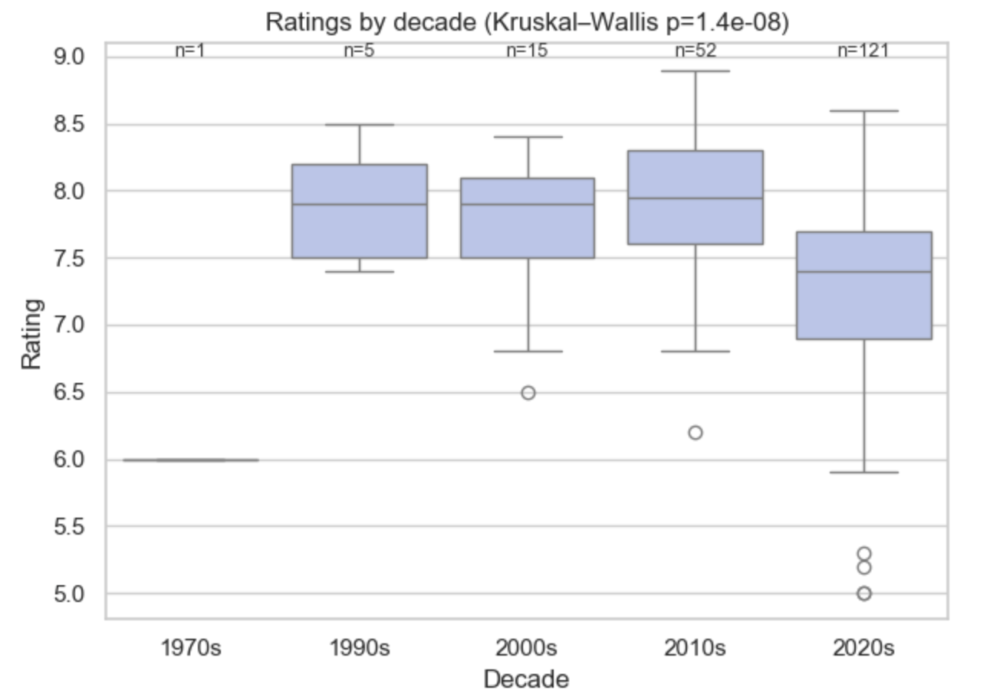

# Web Scraping & Data Analysis


> **A reproducible research pipeline designed to harvest entertainment metadata and perform statistical inference on TV show lifecycles and audience reception.**

## 📖 Overview

**Web Scraping & Data Analysis** is a dual-phase engineering and analytics project. It establishes an automated data acquisition framework to **scrape data from TVmaze**, constructing a granular dataset of television specifications, including air dates, weighted ratings, and network metadata.

Moving beyond simple extraction, the project applies rigorous statistical methodologies (Kruskal-Wallis, Mann-Whitney U) to validate hypotheses regarding media consumption. It investigates the existence of "Golden Age" windows, quantifies the "legacy bias" in completed series, and models the non-linear relationship between show longevity and critical acclaim.

---

## ✨ Key Features

### 🛠 Data Engineering Pipeline

* **Automated Extraction Engine:**
    * Implements a resilient **web scraper** utilizing a **seed-based crawling strategy** to discover and fetch canonical show data.
    * Uses **BeautifulSoup** to parse HTML content and extract unstructured metadata from detail pages.
    * Handles HTTP request logic with **polite throttling** and **retry mechanisms** to ensure dataset integrity.


* **Serialization & Structuring:**
* Normalizes semi-structured JSON responses into tabular formats.
* Exports processed datasets to CSV (`Jiahui.Hu+2252518.csv`) for persistent storage and interoperability.


* **Feature Extraction:**
* **Temporal Dimensions:** Premiere Year, End Date, Duration.
* **Categorical Metadata:** Genres, Network, Status (Running/Ended).
* **Qualitative Metrics:** Weighted Audience Ratings, Summary Text.


### 📊 Statistical Inference & Analysis

* **Hypothesis Testing:** Utilization of non-parametric tests (Mann-Whitney U, Kruskal-Wallis) to handle non-normal distribution in rating data.
* **Trend Modeling:** Regression analysis to identify "Golden Window" eras.
* **Survival Bias Investigation:** Analytical breakdown of "Ended" vs. "Running" shows to isolate reception anomalies.

---

## 📈 Research Findings

Based on the empirical analysis of the harvested TVmaze dataset, this study challenged several common industry assumptions.

### Statistical Summary

| Research Question | Metric / Test | Outcome | Key Insight |
| --- | --- | --- | --- |
| **Q1: The "Golden Window"** | Kruskal-Wallis Test | **H=36.92, p<0.001** | Significant regression advantage for **1990s** shows over the 2010s. |
| **Q2: Status Comparison** | Mann-Whitney U | **p=0.0037** | **Ended** shows (Median 7.90) statistically outperform **Running** shows (Median 7.50). |
| **Q3: Longevity Impact** | Linear Regression | **Non-Significant** | "Longer is Better" is rejected. Data follows a **non-linear** "Early Rise — Mid Plateau — Late Decline" curve. |

<div align="center">
  
</div>

**Figure 1 (Derived):** The analysis indicates that high ratings are not concentrated in long-running modern shows, but rather in completed series from specific historical decades, suggesting a strong "Survivor Bias" in retrospective ratings.

---

## 📂 Project Structure

```text
Web_Scraping_Data_Analysis/
├── Web Scraping & Data Analysis.ipynb   # Main Jupyter Notebook (Scraping & Analysis logic)
└── README.md                            # Project Documentation

```

---

## 🚀 Getting Started

### Prerequisites

* **Python 3.8+**
* **Jupyter Lab** or **Notebook**
* **Core Libraries:**
    * `pandas` (Dataframe manipulation)
    * `requests` (HTTP requests)
    * `beautifulsoup4` (HTML Parsing)
    * `scipy` (Statistical testing)
    * `matplotlib` / `seaborn` (Data visualization)


### Installation

1. **Clone the repository:**
```bash
git clone https://github.com/your-username/Web-Scraping-Data-Analysis.git
cd Web-Scraping-Data-Analysis

```


2. **Install dependencies:**
```bash
pip install pandas requests scipy matplotlib seaborn beautifulsoup4

```


### Usage Guide

1. **Launch the Environment:**
```bash
jupyter notebook "Web Scraping & Data Analysis.ipynb"

```


2. **Execute Phase 1 (Data Collection):**
Run the initial cells to trigger the scraper.
> *Output:* This will generate the `Jiahui.Hu+2252518.csv` raw dataset locally.


3. **Execute Phase 2 (Analytical Validation):**
Run the subsequent cells to reproduce the Q1, Q2, and Q3 statistical tests and generate visualization plots.

---

## 🚧 Future Roadmap

* **Asynchronous Scraping:** Implement `aiohttp` and `asyncio` to reduce data collection latency for datasets .
* **Cross-Platform Integration:** Expand schema to ingest metadata from Streaming VOD platforms (Netflix, Hulu) for comparative analysis against Network TV.
* **NLP Sentiment Scoring:** Apply `NLTK` or `TextBlob` to the "Summary" field to correlate plot keywords and sentiment polarity with audience ratings.

---

## 📝 License

Distributed under the MIT License. See `LICENSE` for more information.
